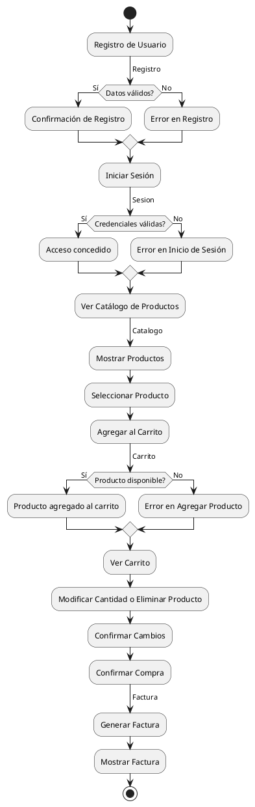

# Diagrama de Actividad del Sistema de Carrito de Compras
- Oscar Guillermo Sierra Lozano.
- Karen Johana Caicedo Arias.

## Descripción 
Este diagrama de actividad describe el flujo de un sistema de carrito de compras desde el inicio hasta la generación de la factura.
Comienza con el registro del usuario, quien ingresa sus datos; si estos son válidos, el registro se confirma, de lo contrario, se
muestra un error. Luego, el usuario procede a iniciar sesión; si las credenciales son correctas, accede al sistema, de lo contrario,
se le indica un error.

Una vez autenticado, el usuario visualiza el catálogo de productos y puede seleccionar productos para agregar al carrito. El sistema
verifica la disponibilidad de cada producto antes de añadirlo; si hay suficiente stock, el producto se agrega, de lo contrario, se
muestra un error.

El usuario puede ver su carrito, modificar cantidades o eliminar productos, y confirmar los cambios realizados. Finalmente, cuando
decide realizar la compra, confirma el pedido, lo que lleva al sistema a generar la factura con los detalles de la compra y
mostrarla al usuario. Este flujo asegura una experiencia ordenada y lógica para el proceso de compra en línea.

## Diagrama

## Resultado
