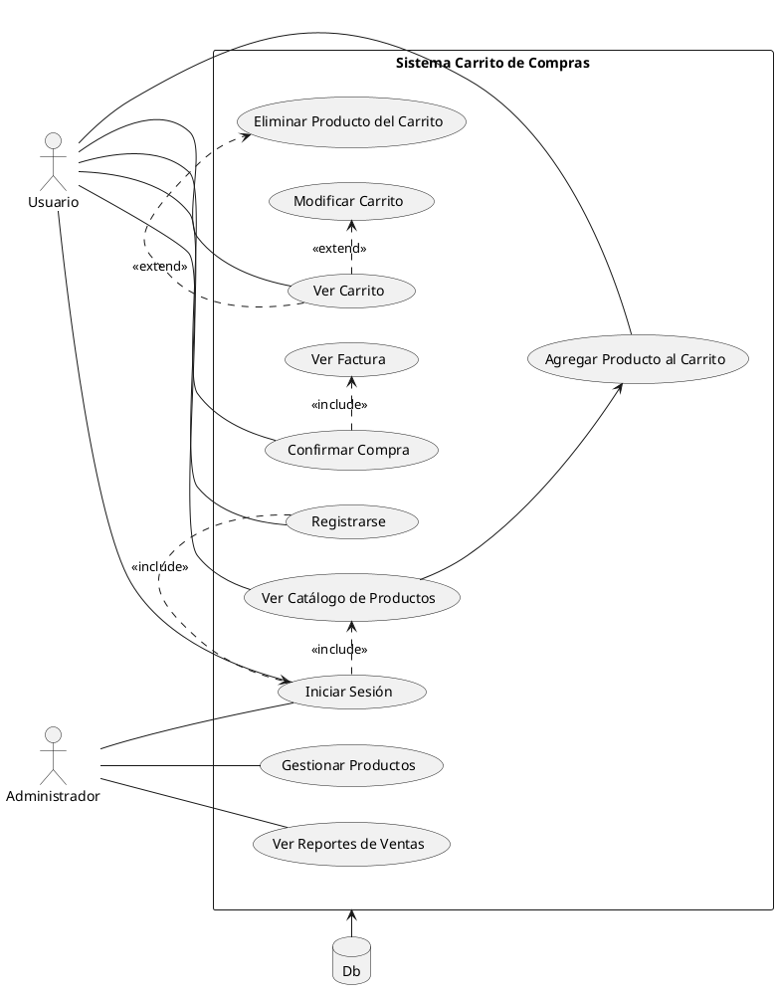

# Diagrama caso de uso el Sistema de Carrito de Compras
- Oscar Guillermo Sierra Lozano.
- Karen Johana Caicedo Arias.

## Descripción 
Este diagrama de casos de uso muestra un sistema de Carrito de Compras con dos tipos de usuarios: Usuario y Administrador.

El Usuario puede registrarse, iniciar sesión, ver el catálogo de productos, agregar productos al carrito, ver y modificar su
carrito, eliminar productos del carrito, confirmar su compra, y ver la factura.
El Administrador tiene permisos adicionales para gestionar el catálogo de productos (añadir, modificar, o eliminar productos) y ver
reportes de ventas del sistema.
Ambos actores interactúan con el sistema de acuerdo a sus permisos, y las operaciones están respaldadas por la base de datos (Db).

## Diagrama

## Resultado
