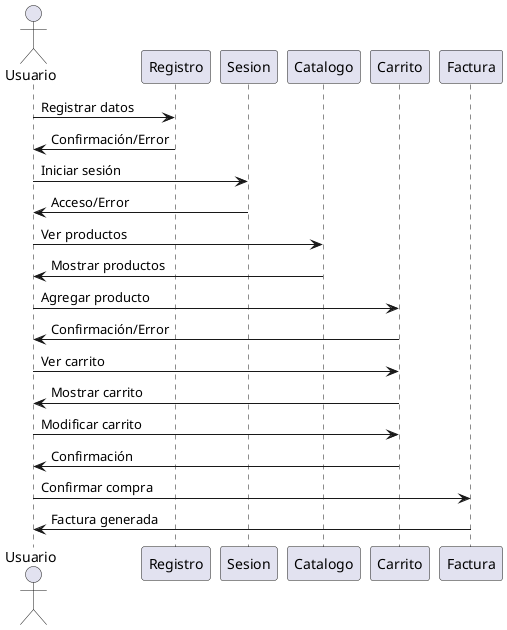
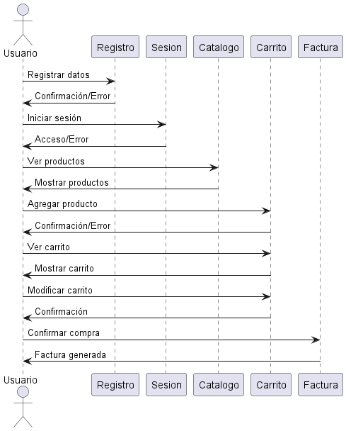

# Diagrama de Colaboración (o Comunicación) del Sistema de Carrito de Compras
- Oscar Guillermo Sierra Lozano.
- Karen Johana Caicedo Arias.

## Descripción 
Este diagrama de colaboración representa la interacción entre un usuario y los diferentes módulos de un sistema de compras. El actor
Usuario realiza acciones como registrarse, iniciar sesión, ver el catálogo de productos, agregar productos al carrito, ver y
modificar el carrito, y finalmente confirmar la compra. Cada uno de estos módulos (Registro, Sesión, Catálogo, Carrito y Factura)
responde al usuario con una confirmación, un error, o mostrando la información solicitada. El flujo de interacciones sigue un orden
lógico de cómo un usuario utilizaría el sistema para realizar una compra.

## Diagrama

## Resultado
