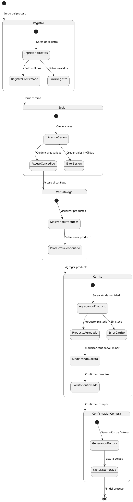

# Diagrama de Estados (o de Estado-Transición) del Sistema de Carrito de Compras
- Oscar Guillermo Sierra Lozano.
- Karen Johana Caicedo Arias.

## Descripción 
Este diagrama de estado describe el flujo de estados en un sistema de carrito de compras. Comienza con el registro, donde el usuario
ingresa sus datos. Si los datos son válidos, el registro se confirma, y el usuario pasa al estado de inicio de sesión. Si las
credenciales son correctas, el usuario accede al sistema; si son incorrectas, se muestra un error.

Después de iniciar sesión, el usuario entra en el estado de ver catálogo, donde puede explorar los productos y seleccionar uno. Esto
lo lleva al estado de carrito, donde puede agregar productos especificando cantidades. Si el producto está en stock, se agrega al
carrito; de lo contrario, se muestra un error. En el carrito, el usuario puede modificar las cantidades o eliminar productos, y
luego confirmar los cambios.

Finalmente, el usuario pasa al estado de confirmación de compra, donde el sistema genera una factura. Cuando la factura es creada,
el proceso de compra termina. Este flujo asegura que el usuario pase por los pasos clave de registro, sesión, visualización de
productos, y compra final, con control de errores en cada etapa.

## Diagrama

## Rsultado
