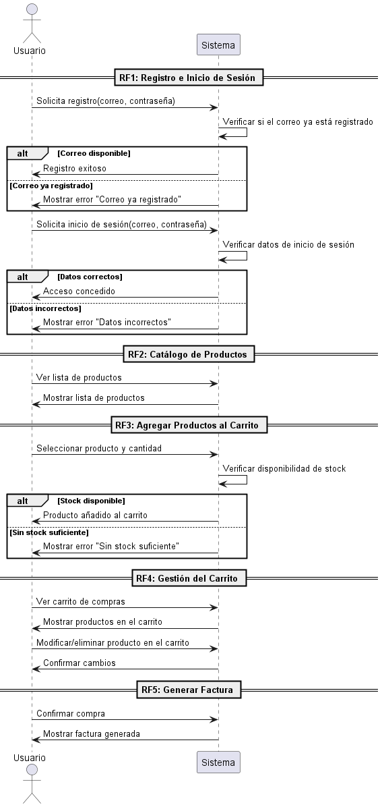

# Diagrama de secuencia
- Oscar Guillermo Sierra Lozano.
- Karen Johana Caicedo Arias.

## Descripción General
El diagrama de secuencia del programa de carrito de compras muestra la interacción entre el usuario y el sistema en cinco
funcionalidades clave:
- ### Registro e Inicio de Sesión: 
    El usuario se registra proporcionando sus datos y, si el correo es válido, accede al sistema. Luego puede iniciar sesión ingresando
su correo y contraseña.
- ### Catálogo de Productos: 
    El usuario puede ver una lista de productos disponibles.
    Agregar Productos al Carrito: El usuario selecciona un producto y cantidad, y el sistema verifica el stock. Si hay disponibilidad, se añade al carrito.
- ### Gestión del Carrito: 
    El usuario visualiza el carrito, puede modificar cantidades o eliminar productos.
    Generación de Factura: Al confirmar la compra, se genera una factura con los detalles del pedido.
- ### Agregar Productos al Carrito: 
    El usuario selecciona un producto y cantidad, y el sistema verifica el stock. Si hay disponibilidad, se añade al carrito.
    Gestión del Carrito: El usuario visualiza el carrito, puede modificar cantidades o eliminar productos.
    Generación de Factura: Al confirmar la compra, se genera una factura con los detalles del pedido.

## Diagrama
´´
uml
    @startuml
    actor Usuario
    participant Sistema

    == RF1: Registro e Inicio de Sesión ==
    Usuario -> Sistema: Solicita registro(correo, contraseña)
    Sistema -> Sistema: Verificar si el correo ya está registrado
    alt Correo disponible
        Sistema -> Usuario: Registro exitoso
    else Correo ya registrado
        Sistema -> Usuario: Mostrar error "Correo ya registrado"
    end

    Usuario -> Sistema: Solicita inicio de sesión(correo, contraseña)
    Sistema -> Sistema: Verificar datos de inicio de sesión
    alt Datos correctos
        Sistema -> Usuario: Acceso concedido
    else Datos incorrectos
        Sistema -> Usuario: Mostrar error "Datos incorrectos"
    end

    == RF2: Catálogo de Productos ==
    Usuario -> Sistema: Ver lista de productos
    Sistema -> Usuario: Mostrar lista de productos

    == RF3: Agregar Productos al Carrito ==
    Usuario -> Sistema: Seleccionar producto y cantidad
    Sistema -> Sistema: Verificar disponibilidad de stock
    alt Stock disponible
        Sistema -> Usuario: Producto añadido al carrito
    else Sin stock suficiente
        Sistema -> Usuario: Mostrar error "Sin stock suficiente"
    end

    == RF4: Gestión del Carrito ==
    Usuario -> Sistema: Ver carrito de compras
    Sistema -> Usuario: Mostrar productos en el carrito

    Usuario -> Sistema: Modificar/eliminar producto en el carrito
    Sistema -> Usuario: Confirmar cambios

    == RF5: Generar Factura ==
    Usuario -> Sistema: Confirmar compra
    Sistema -> Usuario: Mostrar factura generada
    @enduml
´´

## Resultado
