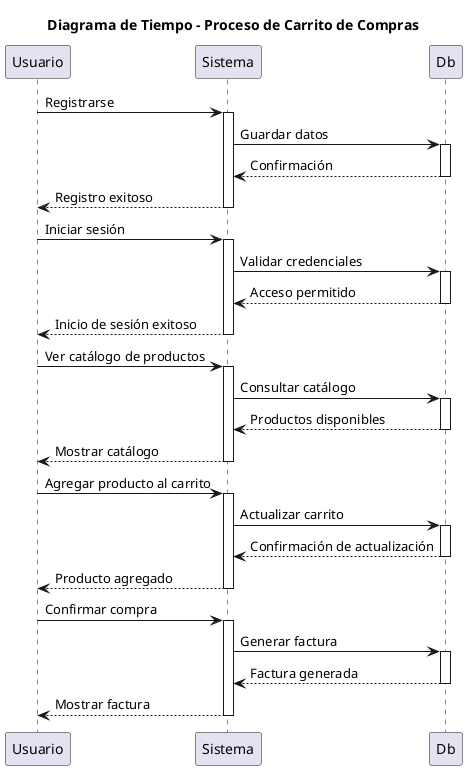
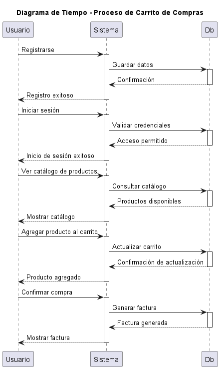

# Diagrama de Tiempo (Timing) del Sistema de Carrito de Compras
- Oscar Guillermo Sierra Lozano.
- Karen Johana Caicedo Arias.

## Descripción 
ESte diagrama de tiempo nos muestra el proceso de interacción entre el usuario y el sistema de carrito de compras:

1. **Registro del Usuario**: El usuario inicia el proceso de registro, el sistema guarda los datos en la base de datos y confirma el
registro exitoso.
2. **Inicio de Sesión**: El usuario se autentica, el sistema valida las credenciales con la base de datos y confirma el acceso.
3. **Visualización del Catálogo**: El usuario solicita ver los productos, el sistema consulta la base de datos y muestra el catálogo
disponible.
4. **Agregar Producto al Carrito**: El usuario agrega un producto, el sistema actualiza el carrito en la base de datos y confirma la
acción.
5. **Confirmación de Compra**: Finalmente, el usuario confirma la compra, el sistema genera una factura en la base de datos y
muestra la factura al usuario.

El diagrama detalla la secuencia de interacciones y el tiempo que cada acción toma, donde evidencia cómo los diferentes componentes
del sistema trabajan juntos para completar el proceso de compra.

## Diagrama

## Resultado
