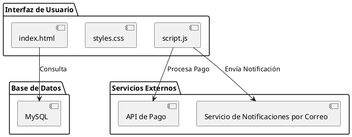

# Diagrama de Componentes del Sistema de Carrito de Compras

-Karen Johana Caicedo Arias.
-Oscar Guillermo Sierra Lozano.

## Descripción General
- Este diagrama de componentes simplificado representa la estructura física de un sistema de carrito de compras básico. Los componentes interactúan de forma directa, enfocándose en la interfaz de usuario y su conexión con la base de datos y servicios externos. Este diagrama facilita el entendimiento de los componentes básicos y su comunicación, sin la necesidad de un servidor de aplicación.

## Diagrama de Componentes
A continuación se presenta el diagrama de componentes del sistema:

## Resultado

