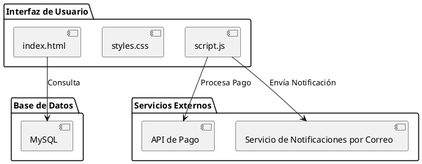
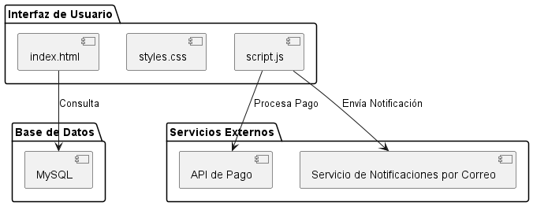

# Diagrama de Componentes del Sistema de Carrito de Compras

-Karen Johana Caicedo Arias.
-Oscar Guillermo Sierra Lozano.

## Descripción General
- Este diagrama de componentes representa los elementos principales de un sistema de carrito de compras básico. Incluye la **Interfaz de Usuario** (con `index.html`, `styles.css`, y `script.js`), la **Base de Datos** en MySQL, y **Servicios Externos** como la API de Pago y el Servicio de Notificaciones por Correo. `script.js` interactúa con la base de datos para gestionar datos de usuarios, productos, e inventarios, y se comunica con servicios externos para procesar pagos y enviar notificaciones al usuario.

## Diagrama de Componentes
A continuación se presenta el diagrama de componentes del sistema:

## Resultado

