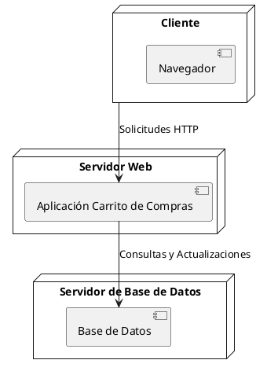
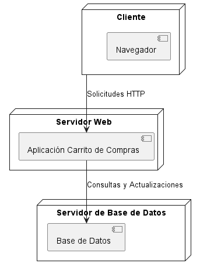

# Documentación Carrito de Compras

-Karen Johana Caicedo Arias.
-Oscar Guillermo Sierra Lozano.

## Descripción 

El Diagrama de Despliegue modela la infraestructura del sistema de carrito de compras. En el **Servidor Web**, se aloja un **Servidor de Aplicaciones** que contiene la API del **Carrito de Compras** y la **Base de Datos**. El **Cliente**, que representa la **Interfaz de Usuario**, se conecta al servidor para interactuar con el sistema. Este despliegue muestra cómo los distintos nodos se comunican entre sí, permitiendo al usuario realizar acciones como registrarse, iniciar sesión, gestionar el carrito de compras y generar facturas, facilitando así la operatividad del sistema.

## Diagrama de Despliegue
A continuación se presenta el diagrama de despliegue del sistema:

# Resultado

