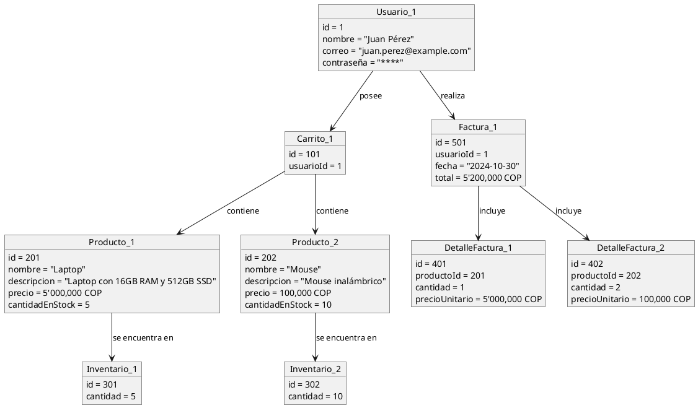
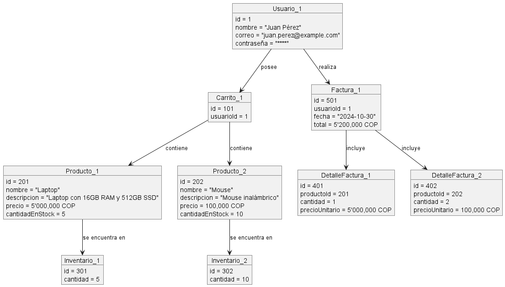

# Documentación del Diagrama de Objetos del Sistema de Carrito de Compras
-Karen Johana Caicedo Arias.
-Oscar Guillermo Sierra Lozano.

## Descripción
- El Diagrama de Objetos muestra instancias del sistema de carrito de compras. **Usuario_1** (Juan Pérez) tiene un **Carrito_1** que incluye **Producto_1** (Laptop) y **Producto_2** (Mouse), disponibles en **Inventario_1** y **Inventario_2**. Al confirmar la compra, se genera **Factura_1**, que incluye **DetalleFactura_1** y **DetalleFactura_2** con la cantidad y precio unitario de cada producto, ilustrando las interacciones del usuario con el sistema.

## Diagrama de Objetos
A continuación se presenta el diagrama de objetos del sistema:

## Resultado

