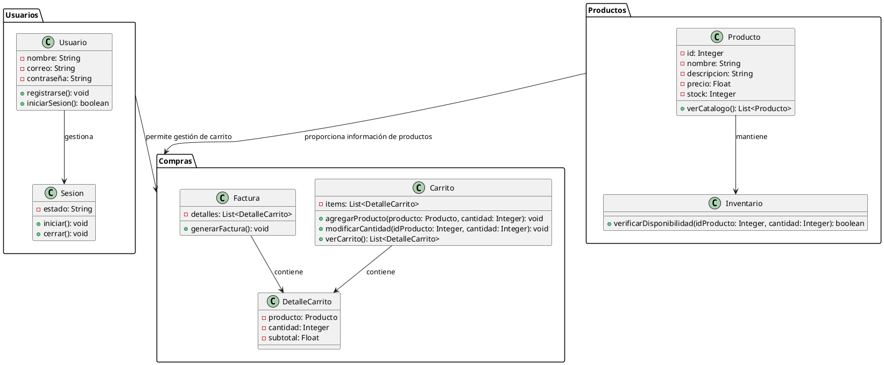
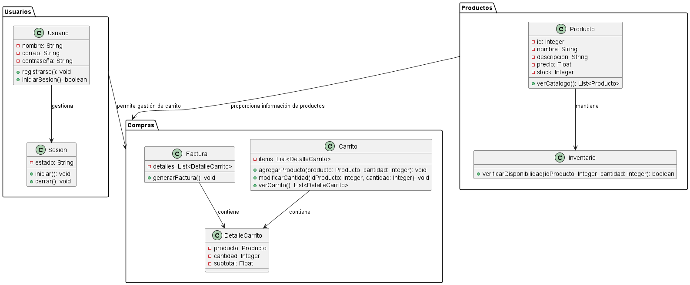

# Documentación del Diagrama de Paquetes del Sistema de Carrito de Compras
-Karen Johana Caicedo Arias.
-Oscar Guillermo Sierra Lozano.

## Descripción 
El diagrama de paquetes organiza el sistema de carrito de compras en tres módulos principales: **Usuarios**, **Productos** y **Compras**. 

- **Usuarios** gestiona el registro y la sesión de los usuarios mediante las clases `Usuario` y `Sesion`.
- **Productos** maneja la información y disponibilidad de los productos con las clases `Producto` e `Inventario`.
- **Compras** administra el carrito de compras y la generación de facturas a través de las clases `Carrito`, `DetalleCarrito` y `Factura`.

Las relaciones entre paquetes indican que **Usuarios** interactúa con **Compras** para gestionar el carrito después del inicio de sesión, y **Productos** proporciona la información necesaria para la selección de productos en el carrito.

## Diagrama de Paquetes

A continuación se presenta el diagrama de paquetes del sistema:

# Resultado

