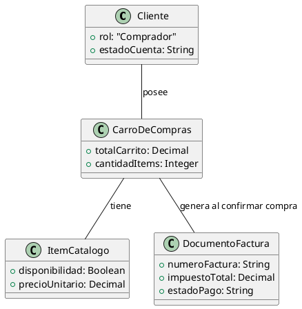
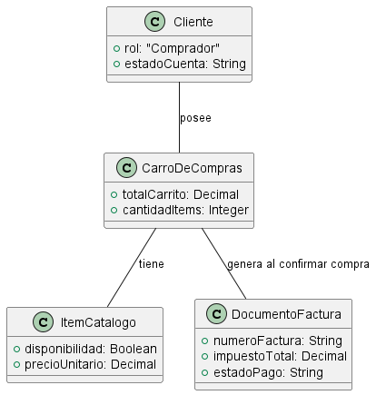

# Documentación del Diagrama de Perfil del Sistema de Carrito de Compras
- Karen Johana Caicedo Arias.
- Oscar Guillermo Sierra Lozano.

## Descripción
- Este diagrama de perfil extiende los elementos clave de un sistema de carrito de compras con estereotipos personalizados: **Cliente** representa a los usuarios que gestionan sus compras, **ItemCatalogo** los productos disponibles, **CarroDeCompras** el contenedor de productos seleccionados, y **DocumentoFactura** la factura generada al confirmar la compra. Las relaciones reflejan que el cliente posee un carrito que contiene productos y genera una factura al finalizar la compra, destacando así las responsabilidades y el flujo de interacción en el sistema.

## Diagrama de Perfil

A continuación se presenta el diagrama de perfil del sistema:

# Resultado

